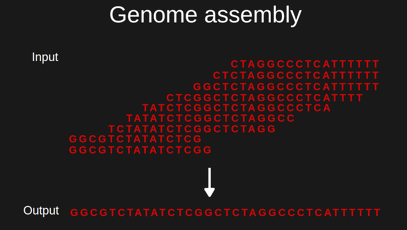
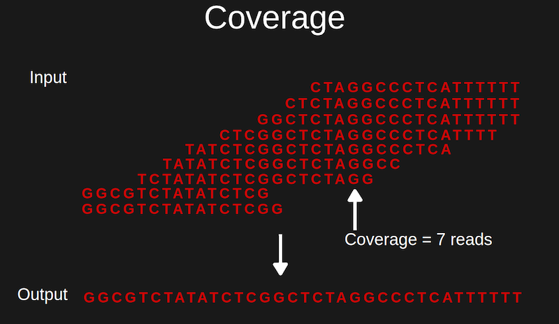
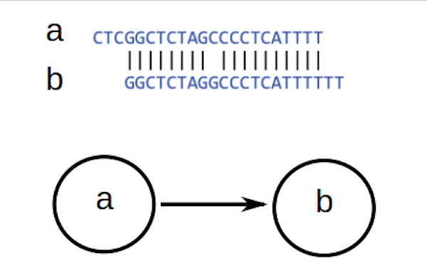
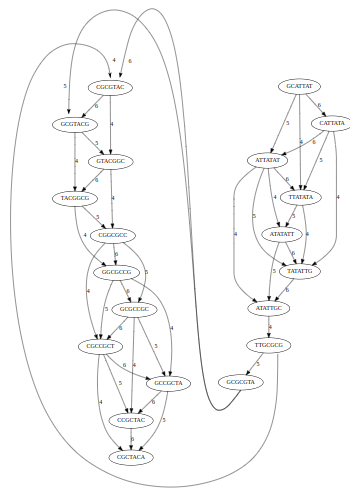
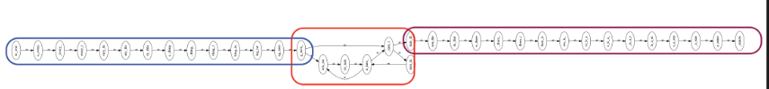

# De-bruijn graphs and String graphs: Genome Assembly

## Shotgun sequencing

Shotgun sequencing approach was used by Celera Genomics, the private
company that sequenced human genome. Shotgun sequencing requires
multiple copy of the genome. It breaks down the genome into millions of
small fragments. Using powerful algorithms and computational resource
part of the genomes are reconstituted by matching and tiling the overlap
of the small fragments. One of the big problem with this approach is
repeat. The private genome project could not finish their job alone
mainly because of this limitation, they needed help from public domain
to complete sequencing the human genome.

There are two types of shotgun sequencing:

1\) Hierarchical shotgun sequencing: It involves breaking down the
genome to overlapping tiling path of BAC (bacterial artificial
chromosome) clones. Then shotgun sequencing and subsequent assembly of
the BAC clones.

2\) Whole genome shotgun sequencing: Straight forward shot gun
sequencing of the genome and assembly.

There is a technological barrier on sequencing long reads with
sufficient accuracy. That's why the inference of whole genome from
fragments accurately is an extremely important problem.

We start with samples containing many copies of DNA (as we mentioned
earlier we need more than one copy otherwise there will be no overlap).
Then break the DNA to small fragments with certain size . There are
algorithms that can be used to infer the whole genome from the
fragments. In this chapter we'll talk about some of the algorithms. The
key idea is that if fragments overlap, then they could have come from the same region of the genome and that information can be used to reconstruct the genome.

Let's introduce the concept of coverage. According to wikipedia,
"Coverage in DNA sequencing is the number of unique reads that include a
given nucleotide in the reconstructed sequence". Coverage represent the
average situation for any nucleotide in the genome. Locally it may
varies from nucleotide to nucleotide.

Low coverage implies a low probability of overlap between reads. By
increasing the coverage (in practice by increasing DNA quantity and
sequencing more reads) we can increase the overall probability of
overlap. More coverage leads to longer overlap. When genome assembly
doesn't assemble the whole genome we'll get isolated islands of genomic
region called contigs.. In practice this is the most likely outcome for
most genomes except very small ones. The repetitiveness of DNA is mainly
responsible for difficulty in assembling a single uninterrupted string
of DNA representing the whole genome. We'll come back to this issue
later in the lecture.

Here we'll discuss about two genome assembly algorithms:

1\. Overlap-Layout-Consensus (OLC) assembly

2\. de Bruijn graph (DBG) assembly

## Overlap-Layout-Consensus (OLC) assembly

###  Overlap:

When Suffix of a read is similar to the prefix of another read we say
there is an overlap. DNA fragments has well defined suffix and prefix
because it has a directionality (5'-3'). When a suffix from read "a" has
an overlap with a prefix of read b we draw an arrow from "a" to "b" .
And on the arrow the length of the overlap is noted.

A graph that contains all overlaps between all possible pairs of read is
called an overlap graph. For an overlap graph a threshold is also
defined, only if the overlap length exceed the threshold then it's
included in the graph.

Indexing to speed up overlap search: We know indexing speed up searching
a pattern in a given text. A suitable index for overlap search can be
created by merging all FM index of all individual reads.

### Layout

The overlap graph is big and messy. It can be tidied up quite a bit if
we remove transitively-inferrible edges.

If there is an edge from a to b , b to c and a to c. The edge from a to
c is transitively-inferrible from edge from a to b and b to c.

After removing edges that skip one node , two nodes , three nodes and so
on the graph becomes cleaner and simplified. Still there will be some
complicated structures like cycles ("A cycle is a path beginning and
ending at the same vertex") and branches left.

Emit contigs corresponding to non-branching stretches.

Repeats make assembly difficult. Repeats leads to cycles in the overlap
graph. If the read length is shorter than the repeat region it's not
always possible to unambiguously resolve the number of repeats in the
region. But if the read length is longer than repeat region it can
anchor the repeat region to flanking non-repeat regions and thus
resolves the ambiguity in repeat number.

You should also prune spurious subgraph, which may represent sequencing error.

### Consensus

Take reads that make up a contig, line them up and for a given position
take the majority vote. The resulting string of DNA is the consensus
sequence for the contig.

*Shorted-common-superstring algorithm*

The algorithm used for OLC assembly is shorted-common-superstring (SCS)
algorithms

Given set of strings S, shortest string containing the strings in S as
substrings is called the shortest common superstring and the algorithm
for finding that is called SCS algorithms.

*Naive SCS algorithm*

1\) Order strings in S in all possible permutation

2\) Concatenate them

3\) Choose the order that has the smallest length as SCS.

*Limitation*

Size of the problem increases at the rate of n!

*Greedy SCS algorithm*

1\) Start with the overlap graph of the strings

2\) Pick two nodes that have the longest overlap.

3\) Merge them

4\) Randomly chose when there is a tie

5\) Repeat steps 2,3 and 4 until there is only one node left which is
the greedy solution for SCS problem

Greedy algorithm is much faster than the naive algorithm.

*Limitations*

Greedy algorithm doesn't always find the correct answer. The algorithms
chooses greedily at each decision point and the solution is not
guaranteed to be SCS.

Shortest common superstring over collapse the number of repeats.

Good news is , "The greedy algorithm is a good approximation; i.e. the
superstring yielded by the greedy algorithm won't be more than \~2.5
times longer than true SCS" (lecture slide)

## De Bruijn graph (DBG) assembly

For the shortest common superstring problem if the genome is repetitive
it will collapse the repeats. An alternative algorithm involves a slightly different kind of graph:

It is a directed graph: the edges has an arrow attached to it. This
graph can have more than one edge pointing from one node to other.

We assume that the sequencing reads are of length k and we consider all possible substring of genome of length k (all possible k-mers)

### Construction of the De bruijn graph:

For each k-mer generate k-1 suffix (or right k-1 mer) and k-1 mer prefix
(or left k-1 mer). These k-1 mers will be the nodes. If a k-1 mer is
already there , no need to make a new node.

Make a directed edge from left k-1 mer to right k-1 mer. This edge
represents the parent k-mer of the corresponding k-1 mers. All distinct
k-1 mers are present as node of the graph. For each k-mer in the
original genome there is a corresponding edge in the de bruijn graph.

## Reconstruction of the original genome 

Reconstruction of the original genome corresponds to a walk in the de bruijn graph. We start from any node in the graph and start moving from node to
node following the directed edge in a walk.

*Eulerian walk*: The walk that goes through all edges exactly ones. An eulerian walk gives the reconstruction of the original genome.

Some property of De bruijn graph:

1. De bruijn graph is directed

2. De bruijn graph is connected: any node in the de bruijn graph can be
rached from any other node.

3. De bruijn graph has two semi-balanced nodes: the number of incoming
eges differ from number of outgoing edges by 1

4. De bruijn graph is an eulerian graph meaning that it always has an
eulerian walk.

Notice, unlike the overlap graphs here we are not looking for overlap
between k-1 mers. We draw the edge that represents the k-mer and we are
done. We get a directed and connected graph that is eulerian.

*Limitations*

The problem is when there are repeats sometimes there can be more than
one eulerian walk. Another problem is , kmers are not reads. Reads are
usually larger (more than 100bp) than k-mer (around 30-40). De bruijn
graph constructed from k-mers from one read is guaranteed to be
Eulerian. But in reality the k-mers are coming from multiple reads. De
bruijn graph constructed from k-mers from multiple read is not
guaranteed to be Eulerian.

As in OLC approach , problem with repeat persists here too. De brujin
graph shuffle the sequence within the repeat region.

Sequencing error, gaps and non-uniform coverage can lead to non-eulerian
graph.

*Error correction*

1. Graph topology based error correction: for example: dead-end and
dconnected bits may represent sequencing errors. Poliploidi can give
re to bubble structure.

2. k-mer based error correction: setting a k-mer frequency threshold to
filter k-mer generated from sequencing error
