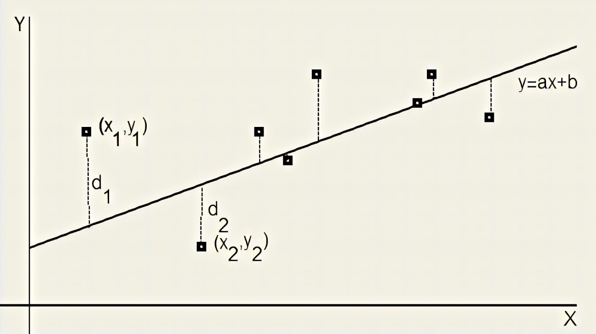
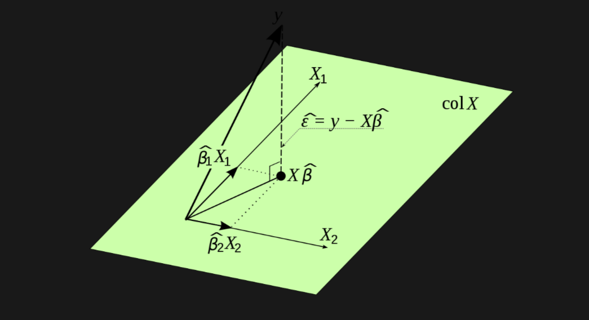

# Linear Regression, Chi-Squared Test of Independence, and applications to GWAS.

## Brief review of linear models

A linear model is a simple way to demonstrate a relationship between two variables. The most powerful statistical tools to process sequencing data exploit the relationship between linear models and hypothesis testing. When we utilize hypothesis testing with linear models, it allows us to ascribe significance to relationships in the data. This is useful in techniques such as Genome Wide Association Studies (GWAS), where we seek to uncover relationships between genetic patterns and certain phenotypes or diseases. Some might even consider linear models to be a simple form of machine learning! The equation for a linear model is given below:

$y_{i} = \beta_{0} + \beta_{1} x_{i} + e_{i}$, $i=1,\dots,n$

Here $e_{i}$ are independent random variables with $E(e_{i}) = 0$ and $Var(e_{i}) = \sigma^2$. The $x_{i}$ are assumed to be fixed. This is referred to as the standard statistical model: value of $y$ is a linear function of $x$ plus random noise. $y$ is called the **dependent** or response variable and $x$ is called the **independent** or predictor variable.

There are several numerical approaches to finding the parameters of a linear model if they must be determined. One such method is called the "Method of Least Squares", and it involves optimizing the $\beta$ parameters such that we minimize the sum of squared residuals. We can write this as the following equation:

$S(\beta_{0}, \beta{1}) = \sum_{i=1}^{n} (y_{i} - \beta_{0} - \beta_{1} x_{i})^2$ 

$\frac{\partial S}{\partial \beta_{0}} = -2 \sum_{i=1}^{n} (y_{i} - \beta_{0} - \beta_{1} x_{i}) = 0$

$\frac{\partial S}{\partial \beta_{1}} = -2 \sum_{i=1}^{n} x_{i} (y_{i} - \beta_{0} - \beta_{1} x_{i}) = 0$

Here $S$ is the sum of squared residuals. Another way of thinking of this is minimizing the squared difference between the actual $y$ values and the fitted $y$ values. Here, partial derivatives are taken with respect to each $\beta$ parameter to minimize the sum of squared residuals. The principle is clearly illustrated in the following image ($d_1$ and $d_2$ represent the distances between the actual y values and their fitted values, which the method of least squares seeks to minimize):

## Relation to Hypothesis Testing

First, we can define the residual sum of squares (RSS) of our data. If the errors are independent normal random variables, then the $\beta$ parameters are normally distributed with

$\frac{\hat{\beta}\_{i} - \beta_{i}}{s\_{\hat{\beta}\_{i}}} \sim t_{n-2}$

Here $t_{n-2}$ is a t-distribution with $n-2$ degrees of freedom. Then, we can test the null hypothesis $H_0:  \beta_1 = 0$. A rejection of this null hypothesis would indicate that the slope of the regression line is non-zero; therefore, a relationship exists between the dependent and independent variable. 

As a reminder, the Student's t-test tests the null hypothesis against a t-distribution. Where our $\beta$ parameters fall in the t-distribution gives us the probability that $\beta_1 = 0$. If the probability $p < 0.05$ (or another significance threshold), we can reject the null hypothesis.

## Relationship to Correlation

Similarly, we can define a correlation coefficient between an independent and dependent variable. The correlation coefficient does not parameterize the relationship between x and y as a linear regression can, but it can be used to determine our confidence in the relationship. Let's define the following quantities:

$s_{xx} = \frac{1}{n} \sum_{i=1}^{n} (x_{i} - \bar{x})^2$

$s_{yy} = \frac{1}{n} \sum_{i=1}^{n} (y_{i} - \bar{y})^2$

$s_{xy} = \frac{1}{n} \sum_{i=1}^{n} (x_{i} - \bar{x}) (y_{i} - \bar{y})$

The correlation coefficient between $x$'s and $y$'s is $r = \frac{s_{xy}}{\sqrt{s_{xx} s_{yy}}}$ and $\hat{\beta}\_{1} = \frac{s_{xy}}{s_{xx}}$; therefore $r = \hat{\beta}\_{1} \sqrt{\frac{s_{xx}}{s_{yy}}}$.

## Multiple Linear Regression

Univariate linear models are useful to test the relationship between a single dependent and independent variable. However, in biology, we often have multiple covariates impacting a single dependent variable. Multiple linear regression allows us to examine the contribution of these multiple independent variables to our dependent variable. 

The formula for multiple linear regression is similar to a simple linear regression. We model $y = \beta_{0} + \beta_{1} x_{1} + \cdots + \beta_{p-1} x_{p-1}$ to fit data: $y_{i}, x_{i1}, x_{i2},\ldots, x_{i,p-1}$ for $i = 1,\ldots,n$

We represent the $x_{i,j}$ by an $n \times p$ matrix $\mathbf{X}$:
$\mathbf{X} = \begin{bmatrix} 
 1  & x_{11} & x_{12} & \cdots & x_{1,p-1} \\
 1  & x_{21} & x_{22} & \cdots & x_{2,p-1} \\
 \vdots & \vdots & \vdots & \vdots & \vdots \\
 1  & x_{n1} & x_{n2} & \cdots & x_{n,p-1} \\
\end{bmatrix}$

Again, we can apply the method of least squares to this problem to find the solution given multiple unknown $\beta$ parameters. In matrix notation, the vector containing all members of $\beta$ is given by the following:

$$\mathbf{X}^{T} \mathbf{X} \hat{\beta} = \mathbf{X}^{T} \mathbf{Y}$$.

If $\mathbf{X}^{T} \mathbf{X}$ is nonsingular, then $\hat{\beta} = (\mathbf{X}^{T} \mathbf{X})^{-1} \mathbf{X}^{T} \mathbf{Y}$

This can be written in terms of the projection matrix, P, which projects onto the p-dimensional subspace of $R^n$ spanned by the columns of X. $\hat{Y}$ is a projection of $Y$ onto the p-dimensional subspace spanned by the columns of $X$. Graphically, we can visualize this projection into a p-dimensional subspace as the following:

## Chi-Squared Test of Independence and Relationship to GWAS

In biology, we can use the chi-squared test to determine if there is a relationship between a disease and a single nucleotide polymorphism (SNP) in the genome. In GWAS, we sequence the genome of a sample population, some with a disease and some without. We can then look for SNPs in the genome and determine the probability that a given SNP is associated with the disease of interest. Chi-squared tests produce the very popular Manhattan plot, where we can compare p-values for individual SNPs across the entire genome. An example Manhattan plot is shown here:

The p-value from the Chi-squared test is given on the y axis and each chromosome is laid out along the x axis. Every point represents a SNP, and the higher the p-value, the more significant its association with the disease of interest.

We will perform the Pearson's chi-squared test which is asymptotically equivalent to the likelihood ratio test. The chi-squared test allows you determine the difference between observed and expected data. We define Pearson's chi-squared statistic:

$$\chi^2 = \sum_{i=1}^{I} \sum_{j=1}^{J} \frac{(O_{ij} - E_{ij})^2}{E_{ij}}$$

Here $O_{ij} = n_{ij}$ are the observed counts and $E_{ij} = n \hat{\pi}\_{ij} = \frac{n\_{i.} n\_{.j}}{n}$ are the expected counts under the null hypothesis.

Pearson's chi-squared statistic is then given by:

$$\chi^2 = \sum_{i=1}^{I} \sum_{j=1}^{J} \frac{(n_{ij} - n_{i.} n_{.j}/n)^2}{n_{i.} n_{.j}/n}$$ 

which is $\chi^2$ distributed with $k$ degrees of freedom. The degrees of freedom are the number of independent counts minus the number of independent parameters estimated from the data. We can calculate p-values from the chi-squared statistic, which can indicate whether a gene is associated with the phenotype of interest.
