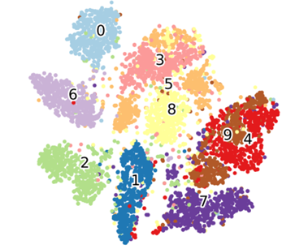
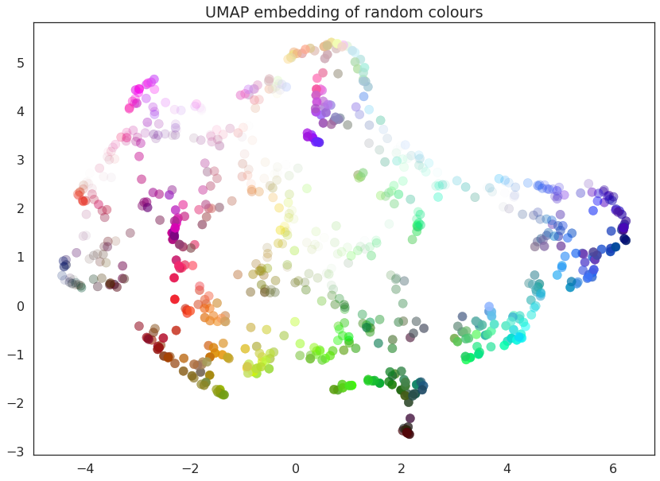

# Dimensionality reduction

## Curse of Dimensionality

{width="7cm"}

Let $V_{HC}$ be the volume of the hypercube and $V_{HS}$ be the volume
of the hypersphere. Now, what happens to volume of these two shapes as
their degree in space approaches infinity? How would you expect
$\frac{V_{HS}}{V_{HC}}$ to change as the degree trends toward infinity?
$$\begin{aligned}
    V_{HC} = (2r)^d\mbox{ and }V_{HS} = \frac{\pi^{d/2}r^d}{\Gamma(\frac{d}{2} + 1)}
    \end{aligned}$$ Thus, $$\begin{aligned}
\frac{V_{HS}}{V_{HC}} = \frac{\pi^{d/2}}{2^{d}\Gamma(\frac{d}{2} + 1)} \rightarrow \frac{1}{\sqrt{\pi d}} \left (\frac{\pi e}{2 d} \right )^{d/2} \rightarrow 0
\mbox{ as d }\rightarrow \infty.
    \end{aligned}$$

And the distance between the center and corners of the hypercube is
$\sqrt{d} r$

### Explanation

Why does this matter? As the degree increases, the probability of an
outlier appearing in the data increases considerably, represented by the
decreasing space between the cube and sphere as the degree approaches
infinity. It's thus important that in cases of high dimensionality that
features share a small standard deviation and are normally distributed
around a center mean so as to limit outliers.

### Summarized: Curse of Dimensionality

1.  Nearly all of high-dimensional space in a hypercube is distant from
    the center and close to the border.

2.  High dimensional datasets at risk of being sparse. The average
    distance between two random points:

    1.  in a unit square is roughly 0.52.

    2.  in a unit 3-d cube is roughly 0.66.

    3.  in a unit 1,000,000-d hypercube is roughly 408.25.

3.  Distances from a random point to its nearest and farthest neighbor
    are similar.

4.  Distance-based classification generalizes poorly unless \# samples
    grows exponentially with $d$.

Biological Networks
-------------------

Biological networks provide a powerful means of representing
relationships between biological entities and/or their functional
components. A common example of this approach is protein-protein
interaction networks where various proteins are stringed together and
the edges between each serve to represent some biological relation. The
properties that allow for biological networks to be so powerful are
provided below.

### Properties of Biological Networks

1.  Highly interconnected with modular structure.

2.  Weakly to strongly scale-free (fraction of nodes with degree $k$
    follows a power law $k^{-\alpha}$).

3.  Subsets of genes, proteins or regulatory elements tend to form
    highly correlated modules.

4.  Functional genomics datasets tend to (not always!) occupy a low
    dimensional subpace of the feature space (e.g., genes, proteins,
    regulatory elements).

5.  Ideal for dimenstional reduction approaches to both visualize and
    analyze functional genomics data.

## PCA: Principal Component Analysis

{width="7cm"}

### Intuition

Given a number of samples, we want to reduce the dimensionality of the
feature set. We find directions that constitute an orthonormal basis in which different individual dimensions of the data are linearly uncorrelated. Principal component analysis (PCA) is the process of computing the principal components and using them to perform a change of basis on the data, sometimes using only the first few principal components and ignoring the rest. 

### Mathematical Basis

Assume we have $n$ samples and $p$ features which are in the form of a
$n \times p$ centered matrix $\mathbf{X}$ where we subtracted the mean
across samples of each feature. The unbiased sample covariance matrix is
then $$\Sigma_{XX} = \frac{1}{n-1} \mathbf{X}^{T} \mathbf{X}$$ PCA finds
a linear transformation $\mathbf{Z} = \mathbf{X} \mathbf{V}$ that
diagonalizes $\Sigma_{XX}$.

### Singular Value Decomposition (SVD)

We can also consider PCA in the context of Singular Value Decomposition,
as the principal components are simply the eigenvectors of the
covariance matrix of the sample data. Moreover, the covariance matrix of
$\mathbf{Z} = \mathbf{X} \mathbf{V}$ where the columns of $\mathbf{V}$
are the right-singular vectors of $\mathbf{X}$ is:

$$\Sigma_{ZZ} = \frac{1}{n-1} \mathbf{Z}^{T} \mathbf{Z} = \frac{1}{n-1} \mathbf{D}^{T} \mathbf{D} = \frac{1}{n-1} \mathbf{\hat{D}}^{2}$$

where $\mathbf{\hat{D}}^{2}$ is a square diagonal matrix (0s truncated),
and we have used the SVD of $\mathbf{X}$,
$(\mathbf{UDV}^{T})^{T} = \mathbf{V} \mathbf{D}^{T} \mathbf{U}^{T}$,
$\mathbf{V}^{T} \mathbf{V} = \mathbf{I}\_{p}$,
$\mathbf{U}^{T} \mathbf{U} = \mathbf{I}\_{n}$.

### Significance of PCA

PCA is a widely applied dimensionality reduction algorithm and is
extremely valuable in reducing the complexity of datasets, allowing for
visualizing data that was once unable to be plotted in 3-dimensional
space. However, in reducing the dimensionality of the data, there is the
obvious tradeoff of information loss that was once captured when all
features were included.

## Non-Negative Matrix Factorization

The goal with Non-Negative Matrix Factorization is to factorize a given
matrix V into a product of two resulting matrices, W (representing
features) and H (storing the weights/coefficients for each feature). It
is important to note that the given matrix V must contain strictly
positive elements. We can find the necessary W and H that when
multiplied together constitute our initial data matrix V using the
following steps:

1.  Initialize $\mathbf{H}$ and $\mathbf{W}$ with non negative values

2.  Update $H_{ij}$ and $W_{ij}$

    1.  $H_{ij} \leftarrow H_{ij} \frac{(\mathbf{W}^{T} \mathbf{V})_{ij}}{(\mathbf{W}^{T} \mathbf{WH})\_{ij}}$

    2.  $W_{ij} \leftarrow W_{ij} \frac{(\mathbf{V} \mathbf{H}^{T})_{ij}}{(\mathbf{W} \mathbf{HH}^{T})\_{ij}}$

3.  Stop when $H_{ij}$ and $W_{ij}$ don't change within a specified
    tolerance

### Significance of Non-Negative Matrix Factorization

By computing a feature matrix and the corresponding coefficient matrix
for a given data matrix, Non-Negative Matrix Factorization allows one to
easily explore the most relevant features to the dataset. This is most
valuable when the dimensionality of the dataset is increased and
extracting the most relevant features becomes difficult.

## t-Distributed Stochastic Neighbor Embedding (t-SNE)

{width="7cm"}

A non-linear dimensional reduction approach that attempts to map a distribution of pairwise distances among nn high-dimensional samples from their high dimension to a distribution of pairwise distances of the nn samples in a low dimension. 

Intuition
---------

While the name may not sound as such, t-SNE is quite an intuitive
approach. This specific algorithm works by first determining the
pairwise distances amongst samples when projected onto the initial
vector space. Once computed, these pairwise distances are used to map
these same samples to a lower dimensional vector space, where the
distances between corresponding samples is maintained.

### Mathematical basis

$$p(j \lvert i) = \begin{cases} 
      \frac{e^{-\Vert \mathbf{x}\_{j} - \mathbf{x}\_{i} \Vert^2/2\sigma\_{i}^{2}}}{\sum\_{k \ne i} e^{-\Vert \mathbf{x}\_{k} - \mathbf{x}\_{i} \Vert^2/2\sigma\_{i}^{2}}} & i \ne j \\
      0 & otherwise \\
   \end{cases}$$

Next, define $$\begin{aligned}
p_{ij} = \frac{p(j|i) + p(i|j)}{2n}
    \end{aligned}$$

In the lower dimensional space, the probability of $\mathbf{y}\_{i}$ and
$\mathbf{y}\_{j}$ being associated/near each other is assumed to follow
a t-distribution with one degree of freedom where for $i \ne j$:

$$\begin{aligned}
        q_{ij} = \frac{(1 + \Vert \mathbf{y}\_{j} - \mathbf{y}\_{j} \Vert^2)^{-1}}{\sum\_{k,l;k \ne l} (1 + \Vert \mathbf{y}\_{k} - \mathbf{y}\_{l} \Vert^2)^{-1}}
    \end{aligned}$$\
With $p_{ij}$ and $q_{ij}$ defined, we can then find the coordinates for
each sample $y_i$ by minimizing the Kullback-Leibler formula, defined
as: $$\begin{aligned}
KL(p \Vert q) = \sum_{i,j;i \ne j} p_{ij} \log \frac{p_{ij}}{q_{ij}}
    \end{aligned}$$\
In doing so, we are minimizing the difference between the distributions
of $p_{ij}$ and $q_{ij}$.

Significance of t-SNE
---------------------

Unlike the previously mentioned dimensionality reduction algorithms,
t-SNE is able to escape overcrowded clusters by maintaining the same
distribution of distances amongst samples, even in a lower dimensional
space.

## Uniform Manifold Approximation & Projection (UMAP)

{width="7cm"}

Unlike many of the previously mentioned algorithms, UMAP is based on a
newly emerging approach to dimensionality reduction known as \"manifold
learning.\" The general idea of manifold learning states that the
dimensionality of a given data matrix exists in a lower dimensional
space but projected in a higher dimension. UMAP is one such example of
this approach and by leveraging what's known as \"simplicial
complexes,\" the topological structure of the input matrix can be
constructed. We can analogize this approach using graph strucutres, The
simplical complexes, illustrated in the figure below, are used to first
derive a higher dimension graphical representation of the input matrix.

{width="7cm"}

Once the higher dimensional simplical complex is formed and accurately
spans the input matrix, the complex is slowly optimized to a lower
dimension, ensuring that the \"connectedness\" of the input points is
maintained. More on this graphical basis for UMAP is discussed in the
following section.

UMAP: Graph Construction
------------------------

Let $\mathbf{x}\_{i},\ldots,\mathbf{x}\_{n}$ be the input data. For each
$\mathbf{x}\_{i}$ compute the $k$ nearest neighbors
$\mathbf{x}\_{i1},\ldots,\mathbf{x}\_{ik}$ and $$\begin{aligned}
\rho_{i} = \min ( d(\mathbf{x}_{i},\mathbf{x}_{ij}) | 1 \le j \le k, d > 0)\\ 
    \end{aligned}$$ and set $\sigma\_{i}$ using

$$\begin{aligned}
\sum_{j=1}^{k} e^{-\max(0,d(\mathbf{x}_{i},\mathbf{x}_{ij}) - \rho_{i})/\sigma\_{i}} = \log_{2}(k)
    \end{aligned}$$

With $\sigma_{i}$ defined, we can then define a weighted directed graph
$\bar{G} = (V,E,w)$ where the vertices $V$ of $\bar{G}$ are the set $X$.
Then form the set of directed edges with weights $w\_{h}$

$$\begin{aligned}
E = \{(\mathbf{x}_{i},\mathbf{x}_{ij}) | 1 \le j \le k, 1 \le i \le n\} \\
w\_{h}(\mathbf{x}_{i},\mathbf{x}_{ij}) = e^{-\max(0,d(\mathbf{x}_{i},\mathbf{x}_{ij}) - \rho_{i})/\sigma_{i}}
    \end{aligned}$$

Combine edges of $\bar{G}$ with adjacency matrix $\mathbf{A}$ into a
unified undirected graph $G$ with adjacency matrix $\mathbf{B}$

$$\begin{aligned}
        \mathbf{B} = \mathbf{A} + \mathbf{A}^{T} - \mathbf{A} \circ \mathbf{A}^{T}
    \end{aligned}$$

where $\circ$ is the Haddamard (or pointwise) product. If $A\_{ij}$ is
the probability that the directed edge from $\mathbf{x}\_{i}$ to
$\mathbf{x}\_{j}$ exists, then $B\_{ij}$ is the probability that at
least one of the two directed edges (from $\mathbf{x}\_{i}$ to
$\mathbf{x}\_{j}$ and from $\mathbf{x}\_{j}$ to $\mathbf{x}\_{i}$)
exists. The intuition behind this next step is difficult to understand
but nonetheless, we carry on. With the adjacency matrix B defined, we
calculate the eigenvectors of the Laplacian $L = D - B$, where D is a
diagonal matrix. The resulting eigenvectors
$\lambda_1, \lambda_2, ..., \lambda_d$ represent the embedding of the
input matrix in $d$-dimensional space.

Significance of UMAP
--------------------

UMAP has been praised for its ability to maintain global structure of
the input. Additionally, its speed has been noted as an advantage,
especially compared to t-SNE where pairwise distances amongst elements
must be computed. Altogether, UMAP shows great prowess in employing the
principles of manifold learning for dimensionality reduction and general
topological data analysis.
