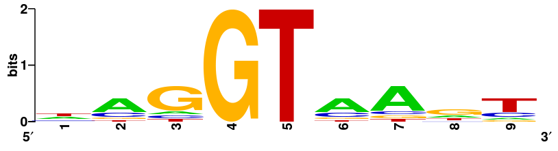

# Epigenomics 01
From Professor Chongzhi Zang's lecture slides "Regulatory DNA, Transcription factors, Sequence motifs". Scribed by Zhaoxia Ma.

## Epigenome
Different cells with similar genome sequences have different genes expression. The epigenome can control gene activities to decide which genes are turned on or off.

"The epigenome is a multitude of chemical compounds that can tell the genome what to do. The epigenome is made up of chemical compounds and proteins that can attach to DNA and direct such actions as turning genes on or off, controlling the production of proteins in particular cells."          
--from genome.gov

## Epigenomic marks

| |Chemical compounds |Proteins |Other molecules <th rowspan=1>Other information</th>
|---|---|---|---
|DNA-associated|DNA methylation|Histones;  DNA-binding proteins  (transcription factors*)|RNA (e.g., R loops)<td rowspan=2> -nucleosome positioning;  - chromatin accessibility;  - 3D genome organization</td>
|Chromatin-associated|Histone modifications: methylations, acetylations, ... |Histone variants;  Chromatin regulators;  Histone modifying enzymes: writer, readers, erasers;  Chromatin remodeling complexes|Non-coding RNAs

 | This is a grid table:

 +------------------------+------------+----------+----------+
 | Header row, column 1   | Header 2   | Header 3 | Header 4 |
 | (header rows optional) |            |          |          |
 +========================+============+==========+==========+
 | body row 1, column 1   | column 2   | column 3 | column 4 |
 +------------------------+------------+----------+----------+
 | body row 2             | Cells may span columns.          |
 +------------------------+------------+---------------------+
 | body row 3             | Cells may  | \[                  |
 +------------------------+ span rows. | f(n) = \sum_{i=1}   |
 | body row 4             |            | \]                  |
 +------------------------+------------+---------------------+

## Epigenomics
### Transcription factors
- The transcription factors (TF) is one of the most important group of proteins which can directly interact with DNA. In this case, the DNA region should be open/accessible to proteins.
- The transcription factors should have DNA-binding domains which are used to recognize specific DNA sequences and sites. They also have effector domains which can regulate TF activity, such as ligand binding domains, can mediate protein-protein interactions, such as BTB domain, and can have enzymatic activities, such as SET domain.
- There are some functional studies related to transcription factors, such as studying for the cell-type specific gene expression, binding DNA sequence motif, genome-wide binding sites, target genes, TF co-factors, etc. 

### Sequence motif
In general, a motif is a distinctive pattern that occurs repeatedly. In biomelecular studies, a sequence motif is a pattern common to a set of DNA, RNA, or protein sequences that share a common biological property, such as functioning as binding sites for a particular protein.

#### Sequence motif finding
For motif finding, the input data is a set of DNA sequences and the output is enriched sequence patterns (motifs).
- Motif representation
  
  Single-letter and ambiguity codes for nucleotides (Table)

  |Symbol|Meaning|Origin of designation|
  |---|---|---|
  |G|G|**G**uanine|
  |A|A|**A**denine|
  |T|T|**T**hymine|
  |C|C|**C**ytosine|
  |R|G or A|pu**R**ine|
  |Y|T or C|p**Y**rimidine|
  |M|A or C|a**M**ino|
  |K|G or T|**K**eto|
  |S|G or C|**S**trong interaction (3H bonds)|
  |W|A or T|**W**eak interaction (2H bonds)|
  |H|A or C or T|not-G, H follows G in the alphabet|
  |B|G or T or C|not-A, B follows A|
  |V|G or C or A|not-T (not-U), V follows U|
  |D|G or A or T|not-C, D follows C|
  |N|G or A or T or C|a**N**y|

  It is derived by IUPAC. one limitation is that they can not measure continue relation/difference because it is binary decision.

- Entropy

    Entropy is used to measure the orderliness. 
    
    Boltzmann entropy: $S_B=-k_B\sum\limits_ip_i\ln(p_i)$
    
    Shannon entropy: $H(X)=-\sum\limits_iP(x_i)\log_2P(x_i)$

- Position weight matrix
    
    Here are some DNA sequences. The first line is the position: 
    $$\begin{matrix}1&2&3&4&5&6&7&8&9\\\\
    G&A&G&G&T&A&A&A&C\\\\
    T&C&C&G&T&A&A&G&T\\\\
    C&A&G&G&T&T&G&G&A\\\\
    A&C&A&G&T&C&A&G&T\\\\
    T&A&G&G&T&C&A&T&T\\\\
    T&A&G&G&T&A&C&T&G\\\\
    A&T&G&G&T&A&A&C&T\\\\
    C&A&G&G&T&A&T&A&C\\\\
    T&G&T&G&T&G&A&G&T\\\\
    A&A&G&G&T&A&A&G&T
    \end{matrix}$$
    
    In each position, we count the number of A, C, G, and T, respectively. Then we get the corresponding position frequency matrix (PFM):
    $$M=\begin{matrix}
    A\\\\
    C\\\\
    G\\\\
    T
    \end{matrix}\begin{bmatrix}
    3&6&1&0&0&6&7&2&1\\\\
    2&2&1&0&0&2&1&1&2\\\\
    1&1&7&10&0&1&1&5&1\\\\
    4&1&1&0&10&1&1&2&6
    \end{bmatrix}$$
    
    Then we simply do a normalization. Each number is divided by the total number of sequences. The corresponding position probability matrix (PPM) is:
    $$M=\begin{matrix}
    A\\\\
    C\\\\
    G\\\\
    T
    \end{matrix}\begin{bmatrix}
    0.3&0.6&0.1&0.0&0.0&0.6&0.7&0.2&0.1\\\\
    0.2&0.2&0.1&0.0&0.0&0.2&0.1&0.1&0.2\\\\
    0.1&0.1&0.7&1.0&0.0&0.1&0.1&0.5&0.1\\\\
    0.4&0.1&0.1&0.0&1.0&0.1&0.1&0.2&0.6
    \end{bmatrix}$$
    
    When we talk about TF binding sites or motifs, we always see some sequence logo. The sequence logo consists of stacks of symbols, one stack is for each position in the sequence. The overall height of the stack indicates the sequence conservation at that position (information content). The height of symbols within the stack indicates the relative frequency of nucleic acid at that position. For example, in this sequence logo, the height of each position is calculated as $R_i=\log_2(4)-H_i$, in which $H_i=-\sum\limits_kM_{k,i}\times\log_2M_{k,i}$
	
	

    Given the PPM (M) and a background model $b$, we can calculate the position weight matrix (PWM). In the PWM, $M_{k,i}=\log_2(M_{k,i}/b_k)$, in which $b=(b_1, b_2, b_3, b_4)=(p_A, p_C, p_G, p_T)$. For nucleotides, $b_k=0.25$. In general, $b_k$ does not have to be equal for each symbol. For example, if the organisms we studied with a high GC-content, the $b_k$ for C and G will be higher than that for A and T. Besides, in practice, in order for convenience for calculation, we will give a pseudo count (such as 0.0001) to 0 to avoid the logarithm of 0.
    
- Motif matching score

  Given the PPM and a background model $b$, we can also calculate the motif matching score using the likelihood ratio score. For example, the score for GAGGTAAAC = $\log_2\frac{p_G\times p_A \times p_G \times p_G \times p_T \times p_A \times p_A \times p_A \times p_A \times p_C}{b_G\times b_A \times b_G \times b_G \times b_T \times b_A \times b_A \times b_A \times b_A \times b_C}$

#### De novo sequence motif finding
The goal of de novo sequence motif finding is to look for common sequence patterns enriched in the input data compared to a background genome. There are two kinds approaches to do de novo sequence motif finding: deterministic approach and probabilistic approach. 

##### Deterministic approach
The deterministic approach is regular expression enumeration. The basic idea for this approach is to check over-representation for every $w$-mer by comparing observed $w$ occurrence in data and expected $w$ occurrence in data. The over-represented $w$ is potential TF binding motif. The advantages of this approach are that it is exhaustive, can guatantee to find global optimum, and can find multiple motifs. For disadvanteges, one is that it is not as flexible with base substitutions and long list of similar good motifs, and the other is that it's limited with motif width.

##### Probabilistic approach
Different from deterministic approach which is pattern driven approach, the probabilistic approach is data driven approach. Expectation-Maximization (EM) approach and Gibbs Sampling are two probabilistic approaches. Here we talk about the EM approach.

The objects of this approach are as follows: $seq$ is sequence data to search for motif; $\theta_0$ is non-motif probability (genome backgrouhnd) parameter; $\theta$ is motif probability matrix parameter; $\pi$ is motif site location. The problem of this approach is to estimate $P(\theta, \pi|seq, \theta_0)$. The approach is to alternately
estimate one of $\pi$ and $\theta$ each time by fixing the other, in which the two steps are called E-step and M-step respectively. Here is an example for this approach:

- E-step: given $theta_0$, $seq$ and $\theta$ to estimate $\pi$, in which $\theta_0$ and $seq$ are known while $\theta$ is given a initial value. In alternative steps, $\theta$ is calculated by M-step. 

  Given an example, $\theta_0: p_{0{\rm A}}=0.3, p_{0{\rm C}}=0.2, p_{0{\rm G}}=0.2, p_{0{\rm T}}=0.3$.
  
    $seq:$
    $$\begin{array}{ccccccccccccccccccc}
    T&T&G&A&C&G&A&C&T&G&C&A&C&G&T& & & & \\\\
    T&T&G&A&C&\ &\ &\ &\ &\ &\ &\ &\ &\ &\ &\ &\ &\ &LR_1\\\\
     &T&G&A&C&G& & & & & & & & & & & & &LR_2\\\\
     & &G&A&C&G&A& & & & & & & & & & & &LR_3\\\\
     & & &A&C&G&A&C& & & & & & & & & & &LR_4\\\\
     & & & &C&G&A&C&T& & & & & & & & & &LR_5\\\\
     & & & & &G&A&C&T&G& & & & & & & & &LR_6\\\\
     & & & & & &A&C&T&G&C& & & & & & & &LR_7\\\\
     & & & & & & &C&T&G&C&A& & & & & & &LR_8\\\\
     & & & & & & & &.&.&.& & & & & & & & \\\\
     \end{array}$$
     $\theta$:
	 
    |pos|A|C|G|T|
    |---|---|---|---|---|
    |1|0.7|0.1|0.01|0.2|
    |2|0.01|0.01|0.8|0.1|
    |3|0.32|0.02|0.3|0.18|
    |4|0.03|0.42|0.1|0.47|
    |5|0.2|0.5|0.1|0.2|
    
    Then, for $LR_1$, 
    \begin{align*}
    P({\rm TTGAC}|\theta_0)&=p_{0{\rm T}}\times p_{0{\rm T}}\times p_{0{\rm G}}\times p_{0{\rm A}}\times p_{0{\rm C}}\\\\
    &=0.3\times 0.3\times 0.2\times 0.3\times 0.2\\\\
    &=1.08\times 10^{-3}\\\\
    P({\rm TTGAC}|\theta)&=P({\rm T\ in\ pos1})\times P({\rm T\ in\ pos2})\times P({\rm G\ in\ pos3})\times P({\rm A\ in\ pos4})\times P({\rm C\ in\ pos5})\\\\
    &=0.2\times 0.1\times 0.3\times 0.03\times 0.5\\\\
    &=9\times 10^{-5}
    \end{align*}
    Therefore, the likelihood ratio of the first motif $\pi_1$ is $LR_1=\frac{P({\rm TTGAC}|\theta)}{P({\rm TTGAC}|\theta_0)}=\frac{9\times 10^{-5}}{1.08\times 10^{-3}}$. Then we can calculate $LR_2, LR_3, LR_4,$ etc.
- M-step: given $theta_0$, $seq$, and $\pi$ to estimate $\theta$, in which $\theta_0$ and $seq$ are known while $\pi$ with its likelihood ratio $LR$ is calculated by E-step. 

  Given an example, $seq={\rm TTGACGACTGCACGT}$, $\pi$ and its likelihood ratio $LR$ are:
  
  |$\pi$|$LR$|
  |---|---|
  |${\rm TTGAC}$|0.8|
  |${\rm TGACG}$|0.2|
  |${\rm GACGA}$|0.6|
  |${\rm ACGAC}$|0.5|
  |${\rm CGACT}$|0.3|
  |${\rm GACTG}$|0.7|
  |${\rm ACTGC}$|0.4|
  |${\rm CTGCA}$|0.1|
  |${\rm TGCAC}$|0.9|
  |...|...|

  Then we can update $\theta$ by estimate the probability of ${\rm A, C, G, T}$ in any of the 5 positions (5 is the length of the motif):
\begin{align*}
P({\rm T\ in\ pos1})=\frac{0.8+0.2+0.9+...}{0.8+0.2+0.6+0.5+0.3+0.7+0.4+0.1+0.9+...} \\\\
P({\rm T\ in\ pos2})=\frac{0.8+0.1+...}{0.8+0.2+0.6+0.5+0.3+0.7+0.4+0.1+0.9+...} \\\\
P({\rm G\ in\ pos2})=\frac{0.2+0.3+0.9+...}{0.8+0.2+0.6+0.5+0.3+0.7+0.4+0.1+0.9+...} \\\\
P({\rm C\ in\ pos5})=\frac{0.8+0.5+0.4+0.9+...}{0.8+0.2+0.6+0.5+0.3+0.7+0.4+0.1+0.9+...} \\\\
...\ ...\ ...
\end{align*}

  After we get the updated $\theta$ from the M-step, we can re calculate the E-step. Iterate the E-step and M-step until $\theta$ does not improve. Then we can find the most frequent k-mers by calculate the likelihood ratio of each $\pi$.
